# Developing applications with Ethereum Blockchain

# 1. Introduction

# 2. Ethereum Protocol

## 2.1 Introduction

Decentralized Applications (DApps)

Why Decentralized Applications?

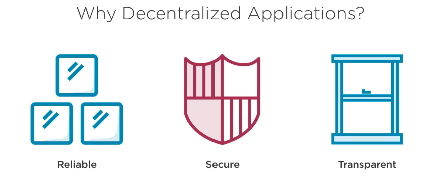

Why Learn Ethereum

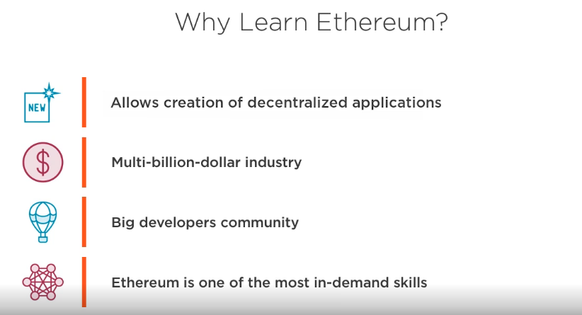

Ethereum Applications

Ethereum Platform

Course Plan

Course Requisites

## 2.2 Blockchain Technology

History of Blockchain

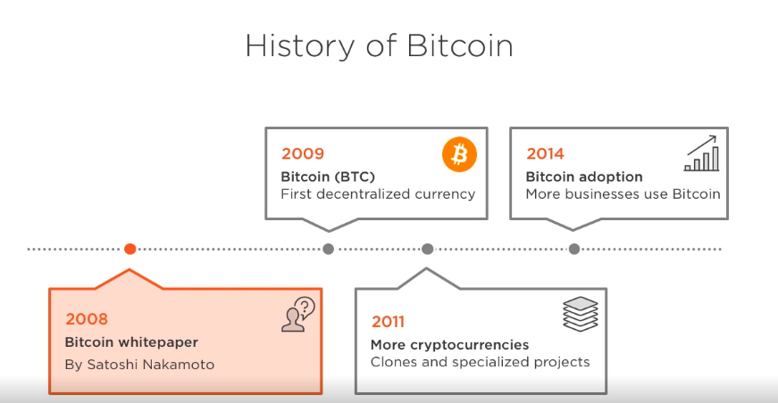

Centralized Financial Institution

Issues with Banking System

Financial System with Bitcoin

Bitcoin Cryptocurrency

Blockchain

Blocks Generation

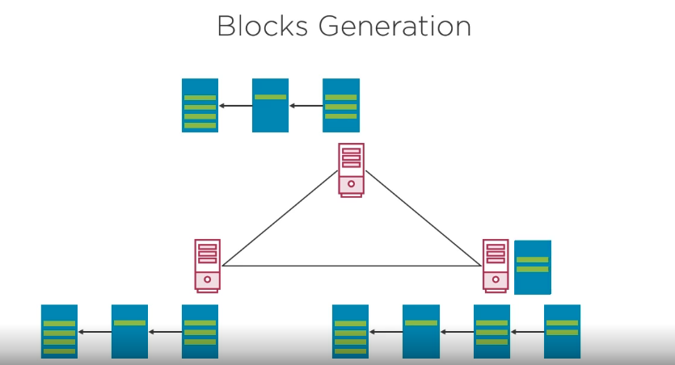

Operations on Blockchain

## 2.2 Hash Functions

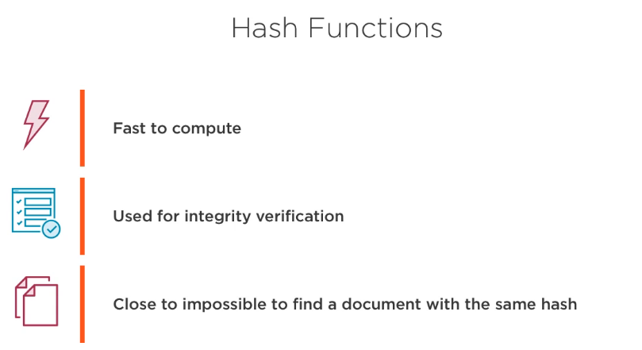

## 2.3 Ethereum Overview

Origins of Ethereum

One Blockchain per Application

The World Computer

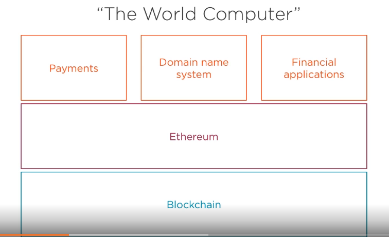

History of Ethereum

Ethereum

Ethereum in a nutshell

Ethereum Projects

Types of Ethereum Networks

## 2.4 Ethereum Wallets

Ethereum Accounts

Ethereum Wallet

The wallet reflects the transactions related with our account

Signing Transactions

Where to get Ether?

Test Networks

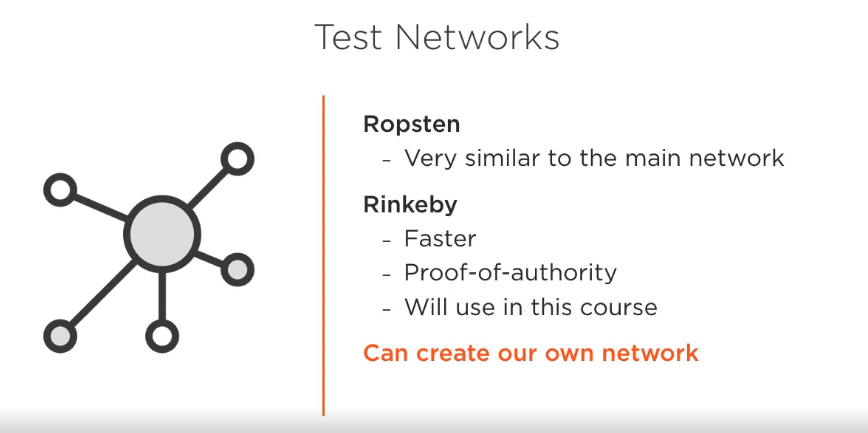

Faucets

## 2.5 Using Ethereum

Demo

I have  used the metamask as Wallet.

Faucet used: faucet.rinkeby.io

Needed to sign-up in Twitter, write a post with my public address and then got 3 ETH finally.

# 3. Getting started with Smart Contracts

## 3.1 Module Overview

## 3.2 Smart Contracts

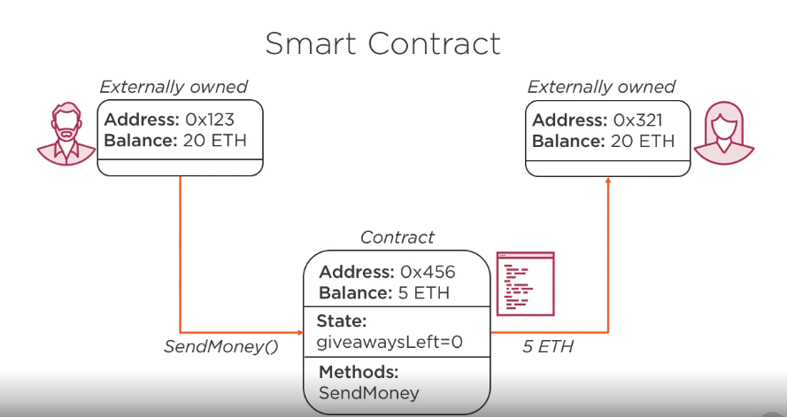

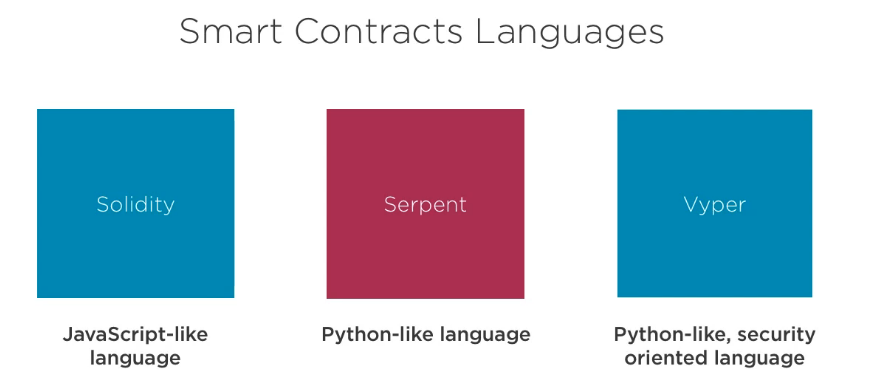

## 3.3 Encapsulation in Solidity

external: only from exterior
public: can be called from outside or inside
none: equals as public
internal: can be called from inside not outside
private: can be called from inside not outside

The difference between internal and private is related to inheritance

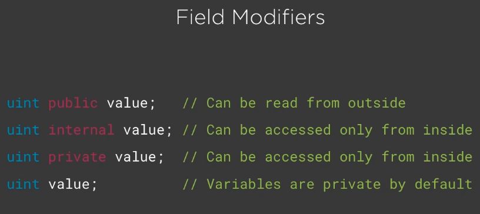

## 3.4 Smart Contracts Execution

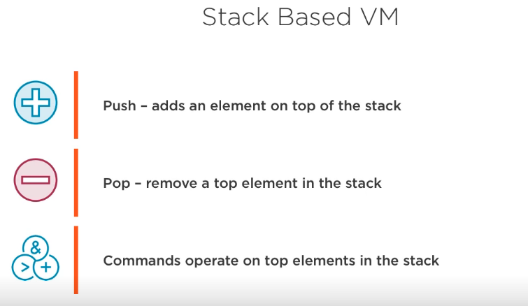

## 3.5 Transactions in Ethereum

nonce: transaction number for a particular account

__Creating a new contract__

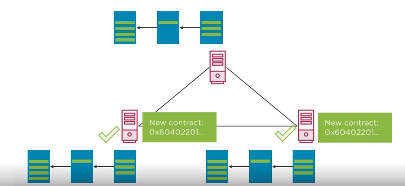

__Calling a method__

__Block Fiels__

__Contracts Limitation__

## 3.6 First Smart Contract

